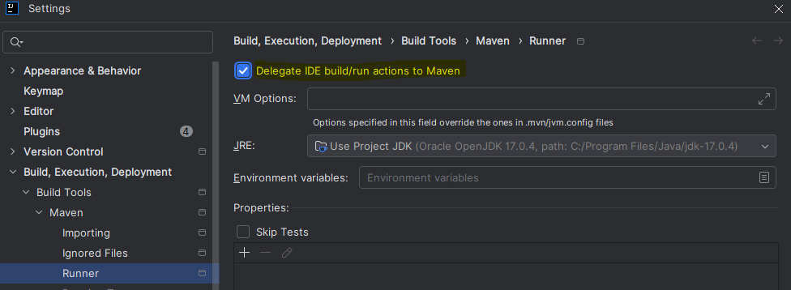

## How To Run:

    1. IDE: run Application class as Spring Boot application
    2. Maven: mvn spring-boot:run
    3. jar: java -jar target/assignment-financing-*.jar (may not work in Windows cmd)


**Warning**: If you are using an Intellij Idea for spring boot application run then please enable checkbox like in the
screen
(it is necessary for the ebean entities enhancement and query beans generation)



## Possible usages of application

1. If the application has just been launched without any changes then db was seeded by flyway migrations with the values
   that were
   present in the
   original
   source code. SeedingService - removed now. Please check the following
   files: [V2__seeding_master_data_script.sql](src/main/resources/db/migration/V2__seeding_master_data_script.sql)
   and [R__seeding_invoices_script.sql](src/main/resources/db/migration/R__seeding_invoices_script.sql). And in this case,
   the correctness of the business logic can be checked using already known values. The processing endpoint:
    ```shell
    POST http://localhost:8080/yb-task/v1/invoices
    Content-Type: application/json
    {
      "processingDate": "2025-01-20",
      "invoicesToProcessAmount": 10000
    }
    ```
   may be called to starts processing of the existing 15 not processed invoices.
2. The application may be switched to the performance testing mode by calling the seeding endpoint.
    ```shell
    POST http://localhost:8080/yb-test/v1/test/seeding
    ```
   It may take around 2 or 3 min. In this case existing records in the db would be truncated and around 500K testing records would be generated and
   added to the database. After seeding the process endpoint would process the amount of invoices meantioned in
   the `invoicesToProcessAmount` field. `batchSize` and `threads` amount are configured in
   the [application.yaml](src/main/resources/application.yaml)

## Database credentials:

```shell
user: sa 
password: pass 
```

H2 console is available here [h2-console](http://localhost:8080/h2-console)

## Swagger UI
http://localhost:8080/swagger-ui/index.html

High overview of the results may be obtained by the following sql query:

    select * from financing_results fr join invoice inv on fr.invoice_id = inv.id join purchaser_financing_settings pfs on fr.purchaser_financing_settings_id = pfs.id join creditor cr on inv.creditor_id = cr.id

## Performance testing results

Laptop configuration: 11th Gen Intel(R) Core(TM) i7-1165G7 @ 2.80GHz 32.0 GB (31.7 GB usable) \
Data base stay: \
~500000 dummy processed invoices (generated with processed = true and `without financing results`), \
~10000 not processed invoices, \
~100 Creditors, \
~100 Debtors, \
~100 Purchasers, \
~10000 Purchaser settings

### 1. Seeding database time by calling

```shell
POST http://localhost:8080/yb-test/v1/test/seeding
```

took `~ 2 min` . Request fails with timeout, but the seeding process continues on background. Logs will tell you when the process is finished

#### Application logs of seeding:

    2025-01-20T04:37:21.658+01:00  INFO 1240 --- [nio-8080-exec-1] l.c.f.c.SeedingTestDataController        : SeedingTestDataController: seedDb requested, 2025-01-20T04:37:21.658007600
    2025-01-20T04:39:17.187+01:00  INFO 1240 --- [nio-8080-exec-1] l.c.f.c.SeedingTestDataController        : SeedingTestDataController: seedDb finished, 2025-01-20T04:39:17.187567900


### 2. Processing 10000 invoices by calling:
```shell
POST http://localhost:8080/yb-task/v1/invoices
Content-Type: application/json

{
  "processingDate": "2025-01-20",
  "invoicesToProcessAmount": 10000
}
```

took `~ 5743ms (5 s 743 ms)`
#### The application logs of the performance testing

    2025-01-20T04:43:25.252+01:00 TRACE 1240 --- [nio-8080-exec-5] m.m.a.RequestResponseBodyMethodProcessor : Read "application/json;charset=UTF-8" to [ProcessInvoiceRequest[processingDate=2025-01-20, invoicesToProcessAmount=10000]]
    2025-01-20T04:43:25.324+01:00 TRACE 1240 --- [nio-8080-exec-5] o.s.web.method.HandlerMethod             : Arguments: [ProcessInvoiceRequest[processingDate=2025-01-20, invoicesToProcessAmount=10000]]
    2025-01-20T04:43:25.324+01:00  INFO 1240 --- [nio-8080-exec-5] l.c.f.services.InvoiceProcessService     : InvoiceProcessService: processInvoices started at 2025-01-20T04:43:25.324814500
    2025-01-20T04:43:29.770+01:00  INFO 1240 --- [pool-2-thread-6] l.c.f.services.InvoiceProcessService     : InvoiceProcessService: processing batch 1000 and 2000 by thread pool-2-thread-6 at 2025-01-20T04:43:29.770074700, processing invoices: 1000
    2025-01-20T04:43:29.770+01:00  INFO 1240 --- [pool-2-thread-2] l.c.f.services.InvoiceProcessService     : InvoiceProcessService: processing batch 2000 and 3000 by thread pool-2-thread-2 at 2025-01-20T04:43:29.770074700, processing invoices: 1000
    2025-01-20T04:43:29.770+01:00  INFO 1240 --- [pool-2-thread-1] l.c.f.services.InvoiceProcessService     : InvoiceProcessService: processing batch 0 and 1000 by thread pool-2-thread-1 at 2025-01-20T04:43:29.770524700, processing invoices: 1000
    2025-01-20T04:43:29.771+01:00  INFO 1240 --- [pool-2-thread-5] l.c.f.services.InvoiceProcessService     : InvoiceProcessService: processing batch 8000 and 9000 by thread pool-2-thread-5 at 2025-01-20T04:43:29.771539200, processing invoices: 1000
    2025-01-20T04:43:29.771+01:00  INFO 1240 --- [pool-2-thread-9] l.c.f.services.InvoiceProcessService     : InvoiceProcessService: processing batch 7000 and 8000 by thread pool-2-thread-9 at 2025-01-20T04:43:29.771539200, processing invoices: 1000
    2025-01-20T04:43:29.772+01:00  INFO 1240 --- [ool-2-thread-10] l.c.f.services.InvoiceProcessService     : InvoiceProcessService: processing batch 9000 and 10000 by thread pool-2-thread-10 at 2025-01-20T04:43:29.772817600, processing invoices: 1000
    2025-01-20T04:43:29.772+01:00  INFO 1240 --- [pool-2-thread-8] l.c.f.services.InvoiceProcessService     : InvoiceProcessService: processing batch 5000 and 6000 by thread pool-2-thread-8 at 2025-01-20T04:43:29.772817600, processing invoices: 1000
    2025-01-20T04:43:29.776+01:00  INFO 1240 --- [pool-2-thread-4] l.c.f.services.InvoiceProcessService     : InvoiceProcessService: processing batch 6000 and 7000 by thread pool-2-thread-4 at 2025-01-20T04:43:29.776331500, processing invoices: 1000
    2025-01-20T04:43:29.777+01:00  INFO 1240 --- [pool-2-thread-3] l.c.f.services.InvoiceProcessService     : InvoiceProcessService: processing batch 4000 and 5000 by thread pool-2-thread-3 at 2025-01-20T04:43:29.777332, processing invoices: 1000
    2025-01-20T04:43:29.777+01:00  INFO 1240 --- [pool-2-thread-7] l.c.f.services.InvoiceProcessService     : InvoiceProcessService: processing batch 3000 and 4000 by thread pool-2-thread-7 at 2025-01-20T04:43:29.777332, processing invoices: 1000
    2025-01-20T04:43:30.960+01:00  INFO 1240 --- [nio-8080-exec-5] l.c.f.services.InvoiceProcessService     : InvoiceProcessService: processInvoices finished at 2025-01-20T04:43:30.960604900


### If something goes wrong, just remove the test.mv.db file from the root directory and restart application

## What you get

The application in this repository: 
* creates an H2 database in the root directory of the project;
* sets up the database structure according to the entities;
* seeds some initial data and runs the financing algorithm.

## What you need to do

You need to implement the financing algorithm according to the specification. The algorithm has to
calculate the results of the financing and persist them. The invoices financed in a one application run are considered 
to be "financed" and must not be financed in the subsequent applications runs. 

To store the results of the financing, you will have to adjust the data structure. You are free to create 
new entities and adjust the existing ones.

Your entry point is `FinancingService` class. Naturally, you may create additional
classes, if needed. You can also add new relations, new entities or fields to existing ones. You may also 
use any third-party dependencies you need. 

If you don't like something in the provided code, you are free to change it. You're also free to adjust the
seeding data if you wish to make it more representative.

## Financing algorithm specification

The terminology used here is described in more detail in the Glossary section.

The financing algorithm should be applied separately to each invoice in the database which was not financed yet.

For each non-financed `Invoice`:
1. select the single financing `Purchaser`;
2. calculate financing results: applied financing term, rate and date; early payment amount; 
3. save financing results with link to selected `Purchaser` for the `Invoice` in the database: 
 all monetary values should be stored in `cents` units, rates in `bps` units.

A `Purchaser` is eligible for financing of the `Invoice`, if:
1. the `Purchaser` has set up the settings for the invoice's `Creditor` (has a `PurchaserFinancingSettings` 
  defined for this `Creditor`);
2. the financing term of the invoice (duration between the current date and the maturity date of the invoice) 
  is greater or equal to the value `Purchaser.minimumFinancingTermInDays` for this `Purchaser`;
3. the `Purchaser`'s financing rate for the invoice doesn't exceed the `Creditor.maxFinancingRateInBps` value 
  for the invoice's `Creditor`. 

Of all purchasers eligible for financing, select the one with the lowest financing rate. This will be the 
`Purchaser` that finances the invoice.

Take performance considerations into account: the total amount of invoices in the database could be 
tens of millions of records, with tens of thousands to be financed.

### Example

The rates are measured in bps (basis points). One basis point is 0,01%, or 0,0001.

Suppose today is 2023-05-27. We have 2 purchasers Purchaser1 and Purchaser2 and one creditor Creditor1.
Purchaser1 has set up the annual rate of 50 bps for the Creditor1. Purchaser2 has set up 40 bps for the same creditor.
The Creditor1 has set up 3 bps as maximum financing rate.

The Creditor1 has a single invoice with the value of 10 000,00 EUR and the maturity date of 2023-06-26. 
The financing term of the invoice (duration between today and maturity date) is then 30 days. 

When we run the financing, the financing rate for Purchaser1 for this invoice should be calculated as 
50 bps * 30 days / 360 days/year = 4 bps, the financing rate for Purchaser2 would be 
40 bps * 30 days / 360 days/year = 3 bps. The Purchaser1's financing rate is greater than the maximum financing
rate set up by the Creditor, so only Purchaser2 wins the financing of the invoice.

The early payment amount for the invoice is 10 000,00 EUR - 3,00 EUR = 9 997,00 EUR.

## What we'd like to see

1. implementation of the financing algorithm; 
2. persisting of the financing results;
3. appropriate logging of financing process for observability;
4. tests verifying that your solution is correct;
5. results of performance testing. On typical quad-core x86-64 workstation, we expect to process 10,000 unpaid invoices,  
 for 100 creditors and 100 purchasers in under 30 seconds, even when the database holds over 1,000,000 previously financed invoices;
6. any documentation you think is necessary for your solution;

In case any functional or non-functional requirement are not achieved due to lack of time, 
 provide textual explanation of further steps to explore and implement.

## Glossary

* **Creditor** - a company that has sold some goods to the **Debtor**
* **Debtor** - a company that has purchased some goods from the **Creditor**
* **Invoice** - according to this document, the **Debtor** is to pay to the **Creditor** for the purchased goods 
  on a specific date in the future called **maturity date**.  
* **Maturity date** - the date when the **Creditor** expects the payment from the **Debtor**. If the **Invoice**
is financed, and the **Creditor** already got their money early from the **Purchaser**, this is the date when
  the **Debtor** pays to the **Purchaser** instead.
* **Purchaser** - a bank that is willing to finance the **Invoice** (i.e. provide money for this invoice early 
  to the **Creditor**), with some **interest** subtracted. The **Purchaser** receives the full amount of money 
  from the **Debtor** on **maturity date**, thus receiving their **interest**.  
* **Financing date** - the date on which the financing has occurred.  
* **Financing Term** - the duration in days between the **financing date** and the **Invoice**'s
  **maturity date**. The financing is essentially a loan given by the **Purchaser** to the **Creditor** for the 
  duration of the term, with a certain **financing rate** and responsibility of the **Debtor** to pay back the loan.
* **bps** - basis points, a unit of measure for the rates. 1 bps = 0.01% = 0.0001.
* **Annual Rate** - the interest (in bps) that the **Purchaser** expects to get for the term of 360 days.
* **Financing Rate** - the actual financing rate for a particular **Invoice**, proportional to its financing term. 
  Calculated as `financingRate = annualRate * financingTerm / 360`
* **Early payment amount** - the amount of money paid by the **Purchaser** to the **Creditor** for the particular
financed invoice on **financing date**. This amount is less than the value of the invoice.
